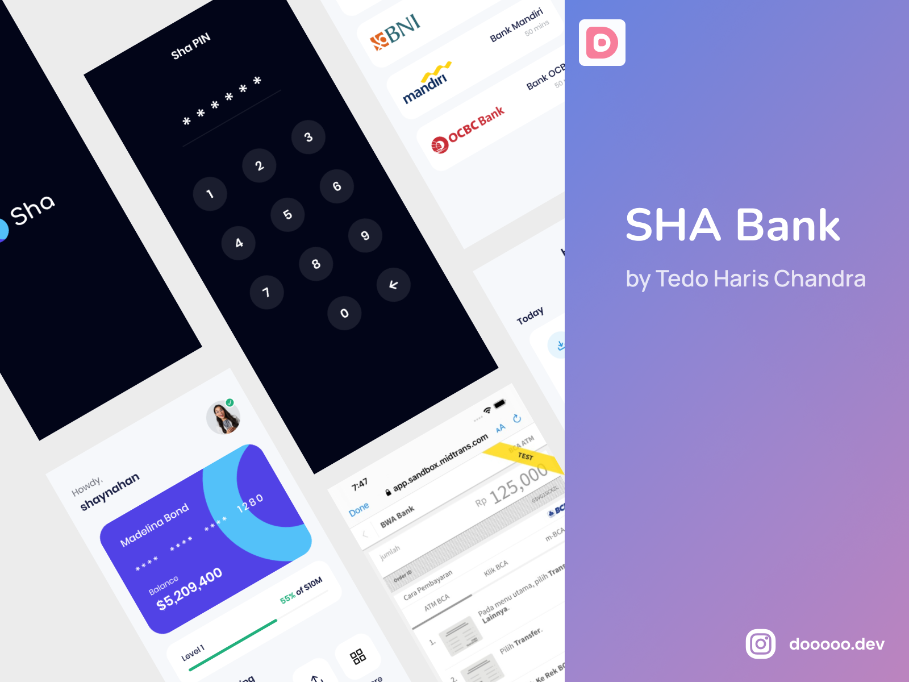

# bank_sha

-- 

Project Topup App and Bank Connected with payment gateway using Flutter framework and Dart Language Programming 

-- 

Using BLOC state management so you can try using this state management in this project. Learn form BWA (buildwithangga)

## Author(s)
**Tedo Haris Chandra** ([Follow my Instagram](https://instagram.com/dooooo.dev))

## Spesification
**Flutter Version** : 3.7.8
**Dart Version** : 2.19.5

## Getting Started (Flutter Documentation)

This project is a starting point for a Flutter application.

A few resources to get you started if this is your first Flutter project:

- [Lab: Write your first Flutter app](https://docs.flutter.dev/get-started/codelab)
- [Cookbook: Useful Flutter samples](https://docs.flutter.dev/cookbook)

For help getting started with Flutter development, view the
[online documentation](https://docs.flutter.dev/), which offers tutorials,
samples, guidance on mobile development, and a full API reference.
